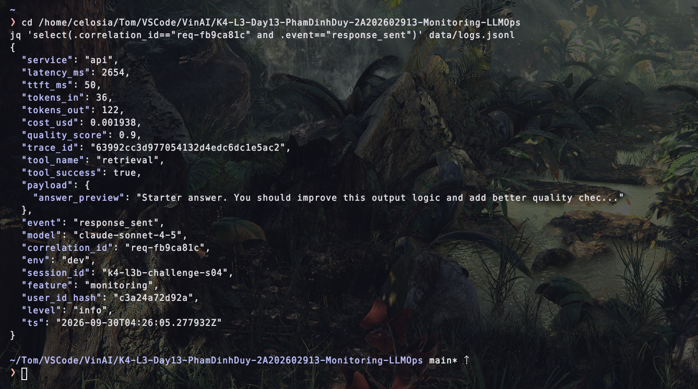
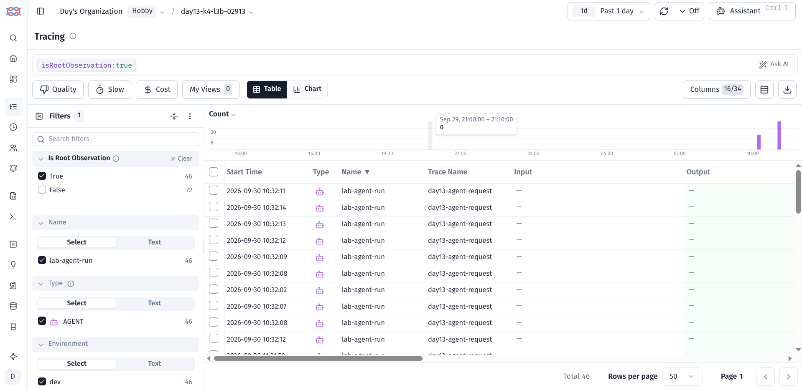
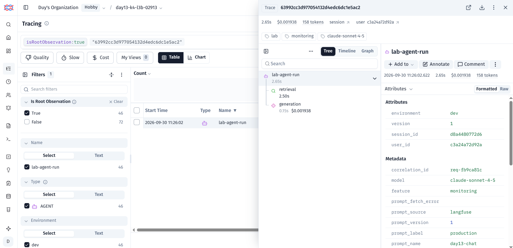
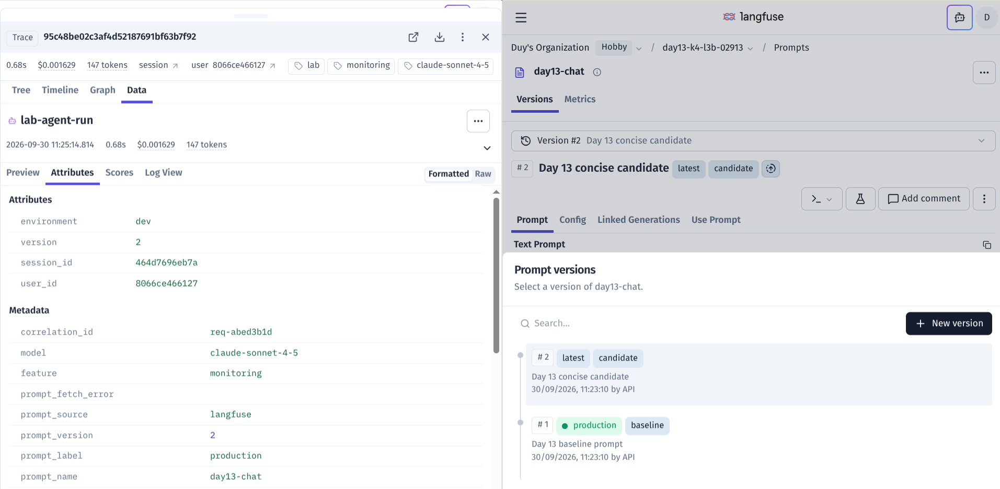
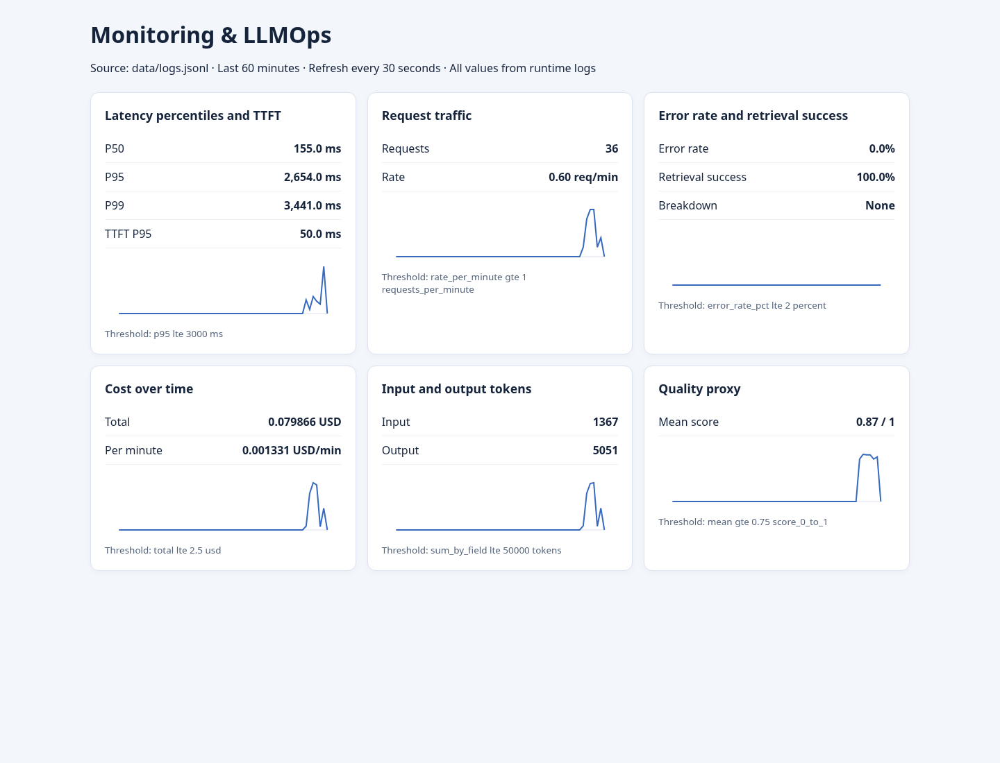

# Báo cáo cá nhân — K4-L3B Day 13 Monitoring & LLMOps

> Mỗi học viên hoàn thiện một file duy nhất này. Chỉ cần 3 output text và 5 ảnh runtime; dùng đường dẫn tương đối, ví dụ `evidence/03-incident-trace.png`.

## 1. Thông tin học viên

- **Họ và tên:** Phạm Đình Duy
- **MSSV:** 2A202602913
- **Lớp:** K4-L3B
- **Repository URL:** https://github.com/Dzzuy/K4-L3-Day13-PhamDinhDuy-2A202602913-Monitoring-LLMOps
- **Commit SHA cuối:** Chưa tạo; điền SHA sau khi commit toàn bộ source và evidence cuối.
- **Challenge ID:** `day13-k4-l3b-monitoring-llmops-v1`
- **Tên project Langfuse cá nhân:** `day13-k4-l3b-02913`

## 2. Evidence index

Giữ đúng ba output text và năm ảnh dưới đây. Không tách thêm ảnh; nếu cần giải thích, ghi bằng chữ trong các mục sau.

| Evidence | Đường dẫn |
|---|---|
| Pytest cuối | `evidence/pytest.txt` |
| Log validator | `evidence/log-validator.txt` |
| Dashboard validator | `evidence/dashboard-validator.txt` |
| Structured log + incident log | `evidence/01-incident-log.png` |
| Trace list | `evidence/02-trace-list.png` |
| Trace waterfall + metadata + incident trace | `evidence/03-incident-trace.png` |
| Prompt versions + promote/rollback | `evidence/04-prompt-versioning.png` |
| Dashboard + incident metric | `evidence/05-dashboard-incident.png` |

## 3. Kết quả kỹ thuật

| Nội dung | Baseline | Kết quả cuối | Nhận xét |
|---|---:|---:|---|
| `validate_logs.py` | 30/100 | 100/100 | Baseline có 20/21 dòng thiếu field; lần chạy cuối có 121 dòng, 58 correlation IDs và 0 PII leak |
| `validate_dashboard.py` | 6/6 | 6/6 | Contract YAML có đủ sáu panel |
| `pytest` | 22 tests pass | 30 tests pass | Bổ sung test cho context, PII lồng nhau, dashboard, load-test failure và cờ tắt tracing |
| Số traces | 0 trong lần baseline code | >10 traces tự tạo | Đạt yêu cầu tối thiểu trong project Langfuse cá nhân |
| Số PII leak | 0 | 0 | Validator quét 121 dòng log |
| Latency P95 / TTFT P95 | Chưa đo sạch | 2.654 s / 50 ms | P95 tăng do challenge `rag_slow` |
| Retrieval success rate | Chưa đo | 100% | Challenge là slow retrieval, không phải retrieval failure |

## 4. Logging và PII

- **Cách tạo/nhận và truyền correlation ID:** Middleware xóa context của request trước, chỉ nhận header đúng mẫu `req-<8-hex>`; nếu header thiếu hoặc sai thì sinh UUID rút gọn. ID được bind vào `structlog.contextvars`, lưu trong `request.state`, trả lại qua header `x-request-id` và ghi cùng response.
- **Các metadata được ghi vào structured log:** `user_id_hash`, `session_id`, `feature`, `model`, `env`, latency, TTFT, token, cost, quality, trạng thái retrieval và `trace_id`.
- **Cách bảo đảm PII được scrub trước khi ghi:** `scrub_event` chạy trước `JsonlFileProcessor` và JSON renderer. Hàm `scrub_value` đệ quy qua dict/list/tuple/exception, che email, số điện thoại Việt Nam, CCCD, thẻ thanh toán và hộ chiếu; chỉ giữ nguyên các ID kỹ thuật đúng định dạng.
- **Cách kiểm chứng kết quả:** Test gửi request ID hợp lệ, sai định dạng và thiếu header để kiểm tra isolation. Workload có email, điện thoại và thẻ mẫu; `validate_logs.py` báo 0 PII leak, 0 dòng thiếu schema/context và 100/100.

## 5. Tracing và prompt versioning

- **Cách xác nhận traces do chính tôi tạo trong project cá nhân:** Tôi chạy workload từ repository này với key trong `.env` của project `day13-k4-l3b-02913`. Response và structured log trả trace ID thật; API observations của Langfuse xác nhận các trace nằm trong đúng project.
- **Cấu trúc root/retrieval/generation observations:** Root `lab-agent-run` (AGENT) có hai child cùng parent: `retrieval` (RETRIEVER) và `generation` (GENERATION). Generation lưu model, prompt, token usage và cost; cả hai child lưu correlation ID và latency an toàn.
- **Cách nối trace với log:** `correlation_id` được truyền từ middleware vào trace metadata và đồng thời ghi trong `response_sent`. Ví dụ `req-fb9ca81c` nối tới trace `63992cc3d977054132d4edc6dc1e5ac2`.
- **Prompt name:** `day13-chat`.
- **Version/label baseline:** v1 có `baseline` và `production` sau rollback.
- **Version/label candidate:** v2 có `candidate` và `latest`.
- **Trace ID của mỗi version:** baseline v1 `e4dc7f96ab39344d76e06289b0a99d12`; candidate v2 `3c70d334415950cf2b81e991fedb230f`; production v2 trước rollback `95c48be02c3af4d52187691bf63b7f92`.
- **Cách promote và rollback `production`:** Tôi chuyển `production` sang v2, restart API và tạo trace production-v2 ở trên. Sau đó cập nhật label: v1 nhận lại `baseline, production`, v2 chỉ còn `candidate, latest`. Việc này giữ một đường rollback nhanh mà không sửa source.

## 6. Dashboard, SLO và alerts

- **Dashboard và sáu panel:** Dashboard local đọc trực tiếp `data/logs.jsonl` trong cửa sổ 60 phút, refresh 30 giây và hiển thị latency/TTFT, traffic, errors/retrieval, cost, tokens và quality. Ảnh challenge cho thấy P50 155 ms, P95 2.654 s, P99 3.441 s, TTFT P95 50 ms, 36 request, error 0%, retrieval success 100%.
- **SLO và lý do chọn:** SLO `fast_successful_requests` yêu cầu 99.5% request có `response_sent` và latency không quá 3000 ms trong 28 ngày. Ngưỡng này cao hơn normal baseline khoảng 150 ms nhưng đủ nhạy với retrieval chậm khoảng 2.5 giây cộng overhead; challenge làm P99 vượt 3000 ms.
- **Cách tính error budget:** Error budget là 0.5%. Với 1,000 request trong 28 ngày, tối đa 5 request được phép lỗi hoặc chậm hơn 3000 ms. Alert 5 phút dùng burn rate 4x, tương đương bad-event rate 2%, và cần tối thiểu 10 request để tránh cảnh báo từ một mẫu đơn lẻ.
- **Ba alert và runbook tương ứng:** `high_response_latency` (P95 > 3000 ms/5m), `high_request_failure_rate` (>2%/5m) và `high_cost_per_request` (>0.01 USD/10m). Mỗi rule có severity, duration, owner, Slack `#day13-llmops-alerts` và runbook Metrics → Logs → Traces trong `docs/alerts.md`.

## 7. Điều tra challenge

- **Challenge ID:** `day13-k4-l3b-monitoring-llmops-v1`, seed 1312, incident `rag_slow`, feature `monitoring`.
- **Khoảng thời gian điều tra:** 2026-09-30 04:26:02–04:26:13 UTC (11:26:02–11:26:13 Asia/Ho_Chi_Minh).
- **Triệu chứng từ metrics:** Latency P95 tăng lên 2.654 giây và P99 3.441 giây; TTFT vẫn 50 ms, error rate 0% và retrieval success 100%. Mẫu này cho thấy request chậm nhưng không thất bại.
- **Log line và correlation ID liên quan:** Event `response_sent` tại `2026-09-30T04:26:05.277932Z`, `correlation_id=req-fb9ca81c`, `latency_ms=2654`, `trace_id=63992cc3d977054132d4edc6dc1e5ac2`.
- **Trace ID và span gây ảnh hưởng:** Trace `63992cc3d977054132d4edc6dc1e5ac2`; root 2.655 giây, child `retrieval` 2.501 giây, child `generation` 0.151 giây. Retrieval chiếm khoảng 94% thời gian root.
- **Root cause:** Scenario chính thức bật độ trễ 2.5 giây trong retrieval. Metric, log và trace cùng xác nhận bottleneck nằm ở retrieval, không phải generation hay TTFT.
- **Fix action:** Tắt `rag_slow` bằng injector sau khi thu evidence; trong production sẽ rollback/deploy lại dependency retrieval khỏe, đặt timeout và trả degraded response có kiểm soát nếu vector store chậm.
- **Preventive measure:** Giữ alert cho P95 latency và theo dõi riêng thời gian của retrieval span. Nếu retrieval vượt timeout thì cần fail hoặc fallback có kiểm soát. Trước khi kết luận nguyên nhân, tôi sẽ luôn kiểm tra cùng `correlation_id` giữa log và trace.

## 8. Giải thích và tự đánh giá

- **Một quyết định kỹ thuật quan trọng và lý do:** Tôi tách retrieval và generation thành child observations thay vì chỉ ghi root. Nhờ vậy trace cho biết rõ 2.501 giây nằm ở retrieval, đồng thời generation vẫn có token/cost/prompt version để phân tích độc lập.
- **Một lỗi/blocker đã gặp:** Ban đầu tôi tưởng dashboard dùng Streamlit nên chạy `streamlit run app/dashboard.py`, dẫn đến lỗi dependency và import. Sau khi kiểm tra lại README và source, tôi thấy dashboard của repo chạy bằng `python scripts/dashboard.py --port 8501`. Port 8501 cũng từng bị process cũ chiếm.
- **Cách tìm nguyên nhân và xử lý:** Tôi đối chiếu entrypoint trong `scripts/dashboard.py`, dùng môi trường `.venv` chính của repo và chạy dashboard ở port còn trống. Việc này cũng cho thấy dashboard chỉ đọc log trong cửa sổ 60 phút, nên cần chụp evidence ngay sau workload challenge.
- **Cách hiểu luồng Metrics → Logs → Traces:** Metrics khoanh vùng thời gian và loại triệu chứng. Log chọn một request cụ thể bằng correlation ID. Trace cùng ID phân rã latency theo span để tìm bước gây ảnh hưởng. Root cause chỉ được kết luận khi cả ba lớp nhất quán.
- **Vai trò của prompt version, token/cost, SLO hoặc rollback trong vận hành LLM:** Prompt version gắn thay đổi hành vi với từng trace; token/cost cho thấy tác động tài chính; SLO định nghĩa mức dịch vụ chấp nhận được; label `production` cho phép rollback prompt nhanh mà không cần sửa code.
- **Điều quan trọng nhất đã học:** Trước đây tôi thường xem metric, log và trace riêng lẻ. Qua bài này tôi thấy `correlation_id` là phần quan trọng để nối chúng lại với nhau. Nếu không nối được cùng một request thì rất khó kết luận root cause chắc chắn.
- **Hạn chế hoặc phần chưa hoàn thành, nếu có:** Dashboard hiện đọc log trong cửa sổ 60 phút và chạy local, nên dữ liệu cũ sẽ không còn xuất hiện sau khi hết cửa sổ. Đây là giới hạn của dashboard lab hiện tại, không phải hệ thống monitoring production đầy đủ.

## 9. Checklist trước khi nộp

- [ ] Kết quả và evidence thuộc commit SHA cuối.
- [ ] Tất cả ảnh/output mở được bằng đường dẫn tương đối.
- [ ] Có đúng 3 file text và 5 ảnh runtime theo hướng dẫn.
- [x] Incident evidence nối đúng metric → log → trace.
- [x] Trace/prompt runtime thuộc project Langfuse cá nhân; ảnh không mở trang API Keys.
- [x] Repository chạy lại được theo README.
- [x] Không có secret, API key, PII thô hoặc evidence của người khác/lớp khác.
- [ ] URL repo và commit SHA cuối đã được nộp trên LMS/Codelabs.
